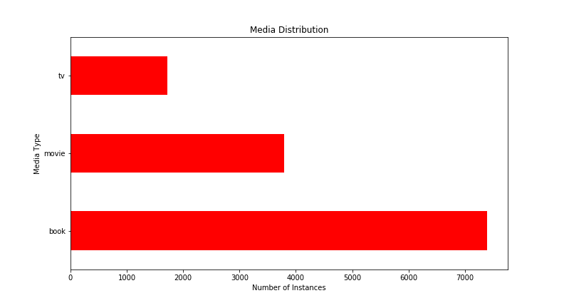
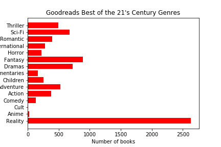
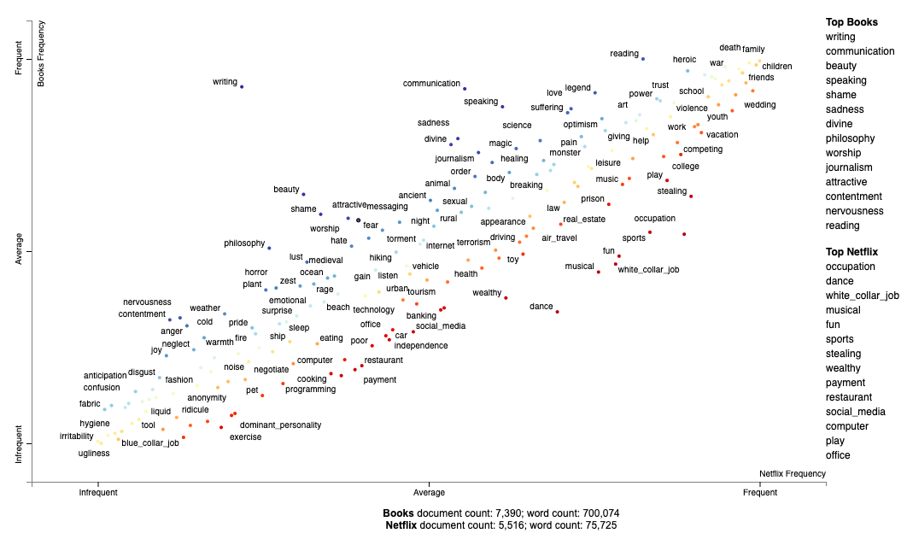

# book-recommendations
Content-based recommendation system to give Netflix movie & TV lovers books they may enjoy based on the similarity of the plot descriptions. 

## Data
The data is composed of 3925 Netflix movies and 1911 Netflix tv shows web scraped from Flixable, a website cataloging all shows and movies available on netflix. Each Netflix entry also had its star rating and associated genres scraped from IMDB. Book data was aquired by scraping a goodreads list of the 7500 best books of the 21 century. 

## EDA

Media Distribution  |   Media Ratings
:---------------------:|:-------------------:
 |  

Looking at the genres of the movies and TV shows taken from Netflix we can see that the most prevalent genre is international. This is because Netflix has many international studios and movies and can more than one genre tag. This means there are many international comedies and interntional dramas. 

Dramas were the second most prevalent in tv shows and movies, and comedies are third most common. After the top three genre classifications we see the genre distributions shift.

Movie Genres        |  TV Genres  
:-------------------------:|:-------------------------:
  |  

After removing books written in another language I observed that book genres were very heavily skew towards reality, which encompases things like region, nature, and self-help. The second most popular category of book was fantasy, and the third was drama.

Book Genres
:-----------------:

## Modeling

After 

Main topics present in books, and netflix shows and movies

And if we ask for a recommendation it pretty closely focuses in on similar material!

