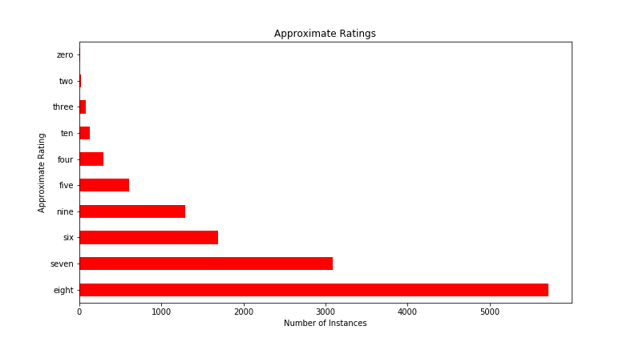

# Movie/TV to Book Recommendations
Content-based recommendation system to give Netflix movie & TV lovers books they may enjoy based on the similarity of the plot descriptions, star ratings, and genres.

## Data
The data is composed of 3925 Netflix movies and 1911 Netflix tv shows web scraped from Flixable, a website cataloging all shows and movies available on netflix. Each Netflix entry also had its star rating and associated genres scraped from IMDB. Book data was aquired by scraping a goodreads list of the 7500 best books of the 21 century. 

## EDA

Media Distribution  |   Media Ratings
:---------------------:|:-------------------:
 |  

Looking at the genres of the movies and TV shows taken from Netflix we can see that the most prevalent genre is international. This is because Netflix has many international studios and movies and can more than one genre tag. This means there are many international comedies and interntional dramas. 

Dramas were the second most prevalent in tv shows and movies, and comedies are third most common. After the top three genre classifications we see the genre distributions shift.

Movie Genres        |  TV Genres  
:-------------------------:|:-------------------------:
  |  

After removing books written in another language I observed that book genres were very heavily skew towards reality, which encompases things like region, nature, and self-help. The second most popular category of book was fantasy, and the third was drama.

Book Genres
:-----------------:

## Feature Engineering 

First I had to prepare the text to be included as features of the reocmmendation by only including relevant words. To do this I defined a function that takes all accented charecters and turns them into their english form. From there, I added entity merging in my spacey pipeline. This means that names of places or things will be recognized as one token during the tokenization process.

### Entitiy recognition

To make sure there are distinguishable topics between books and the Netflix tv shows and movies I then used the Spacey ScatterText for topic modeling. 

### Main topics present in books, and netflix shows and movies
In the below chart, topics in blue are more closely associated with book and topics in red are more closely associated with netflix tv shows or movies. Additionally, the further towards the upper right the topic is, the higher the frequency it appears throughout books, movies, and tv shows.

Of note, when looking at the topics present in the documents, spacey does not only look for a selected word. For example, vampire, myth, alien, supernatural, monstrous, hybrid, folklore, mythic and demonic are considered under the topic of monster topic based on their usage in the corpus of text. 

After tokenizing the plot descriptions, I detokenize the descriptions and merged the text from the genre and ratng columns into the description column of words left after lemmitzation and tokenization. This allows for those attributes to be included as features in the recommendation model. 

## Modeling
After merging everything I used the count vectorizer to form a count matrix. I chose to use the count vectorizer versus the TF-IDF vectorizer because at this point each descriotion is merely a collection of key words. This means using the TF-IDF vectorizer would not properly work as it would not be able to effectively assign differnet weights to each word in the collection of words. 

Within the count vectorizer I set the maximimum degrees of freedom to .7 and the minimum degrees of freedom to 3. This means that if a word or phrase appears in more than 70% of the descriptions to remove it from the text, and if it appears in less than 3 to remove it as well. This is useful because words appearing in more then 70% of documents are usually not of importance and will not be useful in distinguishing one description from the next. Also words appearing in less than 3 description will not have enough frequency to link any of the descriptions together to generate the recommendation. 

From there I used the cosign similarity to calculate the distance between each entry in the matrix to generate a recommendation. I made sure to use pickle to save the cosign similarity matrix so it did not have to be recalculated each time the function is run.  

## Testing the model

And if we ask for a recommendation it pretty closely focuses in on similar material! For example, if we search the netflix tv show 'Van Helsing' and ask to receive a recommendation for a book, we are given novels focused on vampires and the supernatural.  

#### Dependent Libraries
Pandas
requests
csv
numpy
regex
spacy
sklearn.feature_extraction.text
gensim
pickle
sklearn.metrics.pairwise
scattertext
statistics
unicodedata
inflect
pprint
explacy
matplotlib.pyplot
urllib.request
